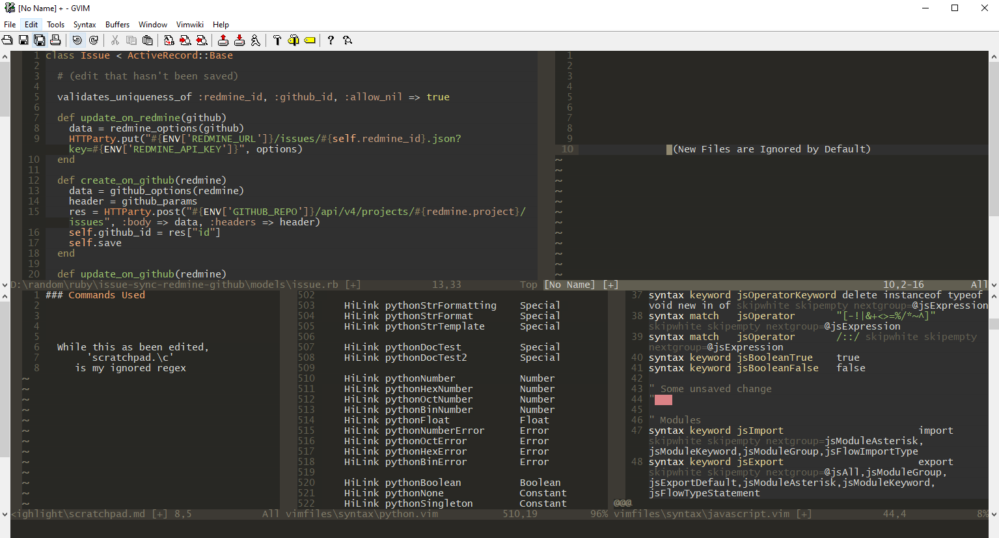

# Modified File Highlight
This plugin changes the Background of Windows that have Edited Buffers Open.

### Screenshot


### Requirements
* ~ Vim V7.3 *(but unsure)*
  * Don't know when `getbufinfo()` Command was added:
  * Used Sources to get a ballpark
* *Note:* Only Tested on My Windows 10 machine using GVIM 8.1

### Sources / Based on
* [vim-diminactive](https://github.com/blueyed/vim-diminactive)
* [vim-StatusLineHighlight](https://github.com/inkarkat/vim-StatusLineHighlight)

### Install Guide
* Package way:
  * Download, the place into plugin folder
    * Mine is: `~/vimfiles/pack/plugin/start/`
* vimrc way:
  * Open: `modifiedfilehighlight.vim`
  * Copy: `s:ShowModifiedBufferStatus()` -> `augroup END`
  * Paste in your vimrc
  * *Note:* Make a Copy of vimrc beforehand incase it hits the fan

### How it Works
On Event: loop through all buffers using `tabpagebuflist()`. If a Buffer's `changed` attribute is true, turn on all colorcolumns for that window, else turn all off

* Current Events: `BufWinEnter,WinEnter,CmdwinEnter,CursorHold,CursorHoldI,BufWritePost`
  * Also: `OptionSet` but above events are mainly what are called.

###### `tabpagebuflist()` *My Understanding*
```vim
" Buffers on tab
ex_tabpagebuflist = [2, 3, 4, 2]

" 2 => Buf 2, Window1
" 3 => Buf 3, Window2
" 4 => Buf 4, Window3
" 2 => Buf 2, Window4

" |-------------------------------|
" |    Window1    |    Window2    |
" |     buf2      |     buf3      |
" |               |               |
" |-------------------------------|
" |    Window3    |    Window4    |
" |     buf4      |     buf2      |
" |               |               |
" |-------------------------------|
"
" This is the general idea
"   I assume it depends on Open Order
```

###### Changing Highlight `ColorColumn`
* Advice: Make it slightly different but noticeable+bearable
```vim
" My Settings (_vimrc)

highlight ColorColumn guibg=#2f2f2f
highlight Normal guibg=#292824
```

### Planned Upgrades
1. Remove Nested Loop
2. Smarter autocmd events
3. Add `Ignore` List
4. Testing

